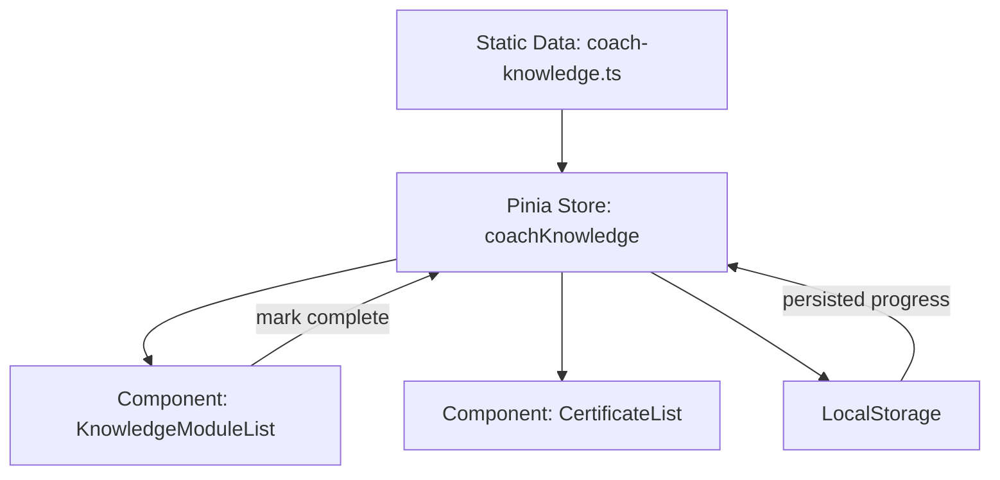
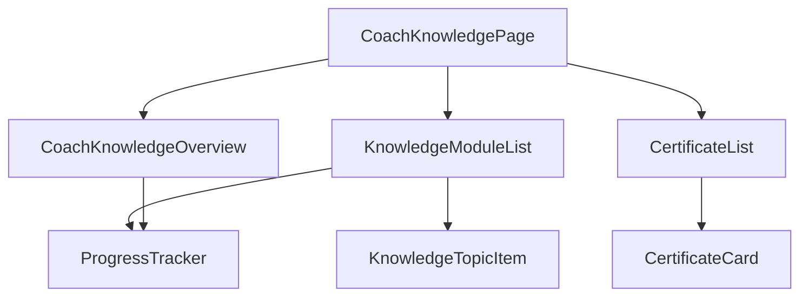

# Design: 健身教练知识储备功能

## 1. 总体架构

- **页面入口**：新增 `src/views/training/coach-knowledge/index.vue`（桌面版）与 `src/views-mobile/training/coach-knowledge/index.vue`（移动版，如沿用移动端布局）。
- **路由**：在 `router/index.ts` 下添加 `/training/coach-knowledge` 路由，分配标题“教练知识储备”。
- **数据**：所有展示所需数据均来源于本地静态数据文件 `src/data/coach-knowledge.ts`，通过 ESM 直接引入并在前端使用，无需任何接口或异步请求。
- **状态管理**：学习进度使用 Pinia 新 store `src/stores/coachKnowledge.ts`，负责读写持久化（localStorage）。无需后端交互。
- **组件拆分**：
  - `CoachKnowledgeOverview.vue`：展示模块概要与进度总览。
  - `KnowledgeModuleList.vue`：按模块渲染知识点、先修顺序。
  - `CertificateList.vue`：展示证书信息。
  - `ProgressTracker.vue`：统一处理学习进度标记与统计。
- **样式**：沿用 Tailwind + Element Plus（可选）组合；主题变量由现有主题系统管理。

### Mermaid：信息流



## 2. 数据模型

### TypeScript 接口（定义于 `src/types/coach-knowledge.ts`）

```ts
interface KnowledgeModule {
  id: string;
  name: string;
  description: string;
  category: 'training' | 'nutrition' | 'emergency' | 'recovery' | 'planning';
  prerequisites?: string[]; // 依赖模块或知识点ID
  topics: KnowledgeTopic[];
}

interface KnowledgeTopic {
  id: string;
  title: string;
  summary: string;
  resources?: Array<{ label: string; url: string }>;
}

interface CertificateInfo {
  id: string;
  name: string;
  organization: string;
  applicableRoles: string[]; // 适用人群
  recommendedModules: string[]; // 建议先修模块ID
  validityPeriod?: string; // 有效期
  level?: 'basic' | 'advanced' | 'specialist';
  description: string;
}

interface ProgressRecord {
  topicId: string;
  status: 'not_started' | 'in_progress' | 'completed';
  updatedAt: string;
}
```

## 3. 数据文件结构

- 新增 `src/data/coach-knowledge.ts`
  - `knowledgeModules: KnowledgeModule[]`
  - `certificates: CertificateInfo[]`
  - 采用静态数组按模块聚合。
- 若需多语言，可在 `i18n` 层扩展；暂使用中文文本。

## 4. Store 设计（`src/stores/coachKnowledge.ts`）

- 状态：
  - `modules`：通过 `import { knowledgeModules } from '@/data/coach-knowledge'` 获取
  - `certificates`：通过 `import { certificates } from '@/data/coach-knowledge'` 获取
  - `progressMap: Record<string, ProgressRecord>`
- Actions：
  - `init()`：同步引入静态数据并写入状态；从 localStorage 恢复进度
  - `setTopicStatus(topicId, status)`：更新状态并写入 localStorage
  - `getModuleProgress(moduleId)`：计算模块完成百分比与状态
- 持久化键名：`coach_knowledge_progress`
- Getters：
  - `moduleList`（带排序）
  - `certificateList`
  - `overallProgress`

## 5. 组件结构



### 关键组件职责

- **CoachKnowledgePage**：页面容器，加载 store、布局内容。
- **CoachKnowledgeOverview**：展示整体进度、模块数量、证书数量等概要数据。
- **KnowledgeModuleList**：渲染每个模块（Accordion 或卡片形式）；内部包含 `KnowledgeTopicItem`。
- **KnowledgeTopicItem**：展示知识点摘要、资源链接、完成状态切换（按钮/复选框）。
- **ProgressTracker**：抽象组件或组合函数，提供进度计算、状态标记、持久化调用。
- **CertificateList**：以列表或卡片呈现证书信息，显示推荐先修模块。
- **CertificateCard**：单证书展示组件。

## 6. 交互流程

1. 页面加载时，调用 store `init()`：加载静态数据、恢复进度。
2. 用户展开模块 -> 查看各知识点 -> 点击“开始学习”或“标记完成”按钮。
3. 组件调用 `setTopicStatus` 更新 state；store 写回 localStorage。
4. Store 通过计算属性更新模块进度百分比；Overview/ModuleList 自动响应。
5. 用户点击证书 -> 展示证书详情（可用 Dialog 或侧边抽屉）。
6. 当模块全部完成时，ProgressTracker 触发提示/推荐下一模块或关联证书。

## 7. UI/UX 要点

- 桌面端：使用两列布局（左模块列表、右侧证书或总结）。
- 移动端：卡片 + 折叠布局，顶部为总览信息。
- Progress 表现：
  - 模块列表中显示百分比 + 状态标签
  - 知识点旁提供 Checkbox 或按钮切换
  - Overview 中显示整体进度条
- 证书列表：按等级或适用人群分类标签。
- 使用 Element Plus 组件（如 `Collapse`、`Progress`、`Tag`、`Card`）提升一致性。

## 8. 路由与导航

- 在 `router/index.ts` 添加：
  ```ts
  {
    path: '/training/coach-knowledge',
    name: 'CoachKnowledge',
    component: () => import('@/views/training/coach-knowledge/index.vue'),
    meta: { title: '教练知识储备' }
  }
  ```
- 将导航入口加入 `Training` 相关菜单或首页快捷入口。
- 移动端布局 `MobileLayout` 中的导航亦需添加对应链接。

## 9. 持久化策略

- 采用 `storageManager` 中的 `localStorageManager`（或直接 localStorage）。考虑到全部数据源为本地文件、无接口依赖，建议创建单独的 helper：
  - 键名：`coach_knowledge_progress`
  - 数据结构：`Record<string, ProgressRecord>`
  - 更新频率：用户点击切换时立即写入。
- 为避免数据不一致，`ProgressRecord.updatedAt` 采用 ISO 字符串。

## 10. 可扩展性

- 可后续接入后台管理：模块与证书数据从 API 获取。
- 增加学习提醒：结合现有通知设置（UserSettings）。
- 与训练计划联动：完成特定模块后在训练页面显示提示。
- 国际化：将文案抽离到语言包。

## 11. 风险与对策

- **数据膨胀**：静态数据过多导致打包体积上升 → 可根据模块拆分懒加载数据文件。
- **进度丢失**：localStorage 清空会丢失记录 → 在 UI 提示可导出/备份（未来扩展）。
- **可访问性**：折叠/卡片结构注意无障碍标签，保留键盘操作能力。

请审阅上述设计，确认或提出修改意见。批准后我将进入任务列表编写阶段。
